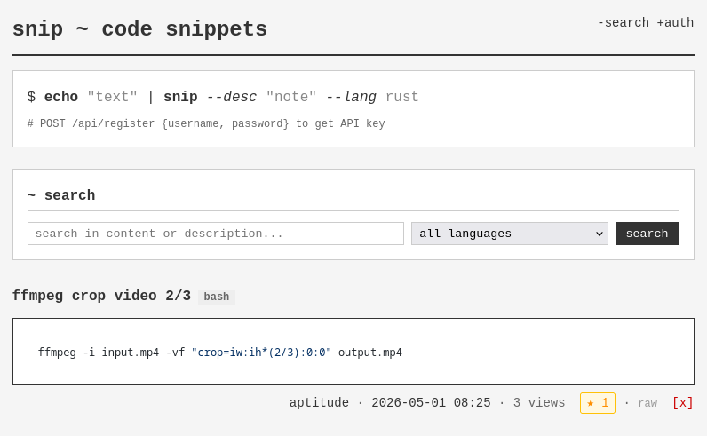

# Snip

A minimal, self-hosted snippet sharing service. Share code snippets via web UI, CLI, or API.

<!---->

## Features

- **Web UI** - Clean interface with syntax highlighting for 25+ languages
- **CLI Tool** - Pipe snippets directly from terminal
- **API** - RESTful API for integration
- **Self-hosted** - Single binary + SQLite, no external dependencies
- **Multi-platform** - Linux (x86_64, aarch64), macOS, Windows

## Quick Start

### 1. Install

**Arch Linux** (recommended):
```bash
yay -S snip-rs
# Start the server
sudo systemctl enable --now snip
```

**Docker**:
```bash
# Run pre-built image from GitHub Container Registry
# docker run -d -p 3000:3000 -v snip_data:/data ghcr.io/skorotkiewicz/snip:latest (not yet)

# Or build locally
docker build -t snip .
docker run -d -p 3000:3000 -v snip_data:/data snip

# Or use docker-compose
docker-compose up -d
```

**From source**:
```bash
cargo install --path .
# Or download from releases
wget https://github.com/skorotkiewicz/snip/releases/latest/download/snip-x86_64-unknown-linux-gnu.tar.gz
```

### 2. Create Account

```bash
# Register a new account
snip register myusername
# Enter password when prompted

# Or login to existing account
snip login myusername
```

Credentials are saved to `~/.config/snip/config.json`.

### 3. Share Snippets

```bash
# Pipe any content directly
echo 'console.log("hello")' | snip --desc "example" --lang javascript

# Or from a file
cat main.rs | snip --desc "main function" --lang rust

# View the snippet
snip get 42

# Get a sharable link
echo "Check this: http://localhost:3000/s/42"
```

## CLI Usage

### Authentication

```bash
snip register <username>   # Create new account
snip login <username>      # Login to existing
snip whoami                # Show current user
snip logout                # Clear saved credentials
```

### Post Snippets

```bash
# Basic usage (reads from stdin)
echo "code here" | snip

# With description and language
cat script.py | snip --desc "My script" --lang python

# Available languages: bash, c, cpp, css, go, html, java, javascript,
# json, kotlin, lua, markdown, php, python, ruby, rust, scala,
# shell, sql, swift, typescript, yaml, zig (and plaintext)
```

### Browse Snippets

```bash
snip get <id>              # View snippet by ID
snip search "query"        # Search all snippets
snip search "fn main" --lang rust   # Search with language filter
snip delete <id>           # Delete your snippet
```

### Shell Completions

```bash
# Add to ~/.bashrc or ~/.zshrc
eval "$(snip complete zsh)" 
```

**Available shells:** `bash`, `zsh`, `fish`, `elvish`, `powershell`

## Web Interface

Open `http://localhost:3000` to:
- Browse all snippets
- Filter by language
- Search by content
- View user profiles (`/u/username`)
- Get raw content (`/raw/123`)

## Server Configuration

### Environment Variables

| Variable | Default | Description |
|----------|---------|-------------|
| `DATABASE_URL` | `sqlite:snip.db` | SQLite database path |
| `SNIP_HOST` | `0.0.0.0` | Bind address |
| `SNIP_PORT` | `3000` | Port number |

### Systemd (Manual Install)

```bash
sudo cp snipped /usr/bin/
sudo cp systemd/snip.service /etc/systemd/system/
sudo systemctl daemon-reload
sudo systemctl enable --now snip
```

### Docker Compose

```yaml
version: '3'
services:
  snip:
    image: ghcr.io/skorotkiewicz/snip
    ports:
      - "3000:3000"
    volumes:
      - ./data:/data
    environment:
      - DATABASE_URL=sqlite:/data/snipped.db
```

## API Reference

All endpoints (except where noted) return JSON.

### Authentication

```bash
# Register
POST /api/register
{"username": "alice", "password": "secret123"}
→ {"id": 1, "username": "alice", "api_key": "xxx"}

# Login
POST /api/login
{"username": "alice", "password": "secret123"}
→ {"username": "alice", "api_key": "xxx"}
```

### Snippets

```bash
# Create (requires API key)
POST /api/snippets -H "X-API-Key: xxx"
{"content": "code", "description": "...", "language": "rust"}

# Get by ID
GET /api/snippets/123

# Delete own snippet
DELETE /api/snippets/123 -H "X-API-Key: xxx"

# List all
GET /api/snippets

# Search
GET /api/search?q=hello&lang=rust&limit=10

# List user's snippets
GET /api/users/alice/snippets
```

### Pages

- `GET /` - Web frontend
- `GET /s/{id}` - View snippet page
- `GET /raw/{id}` - Raw snippet content (text/plain)
- `GET /u/{username}` - User profile

## Architecture

- **Backend**: Axum (Rust) + SQLite
- **Frontend**: Vanilla HTML/JS (embedded in binary, no external assets)
- **CLI**: Rust + clap + reqwest
- **Syntax Highlighting**: highlight.js (CDN)

## License

MIT
